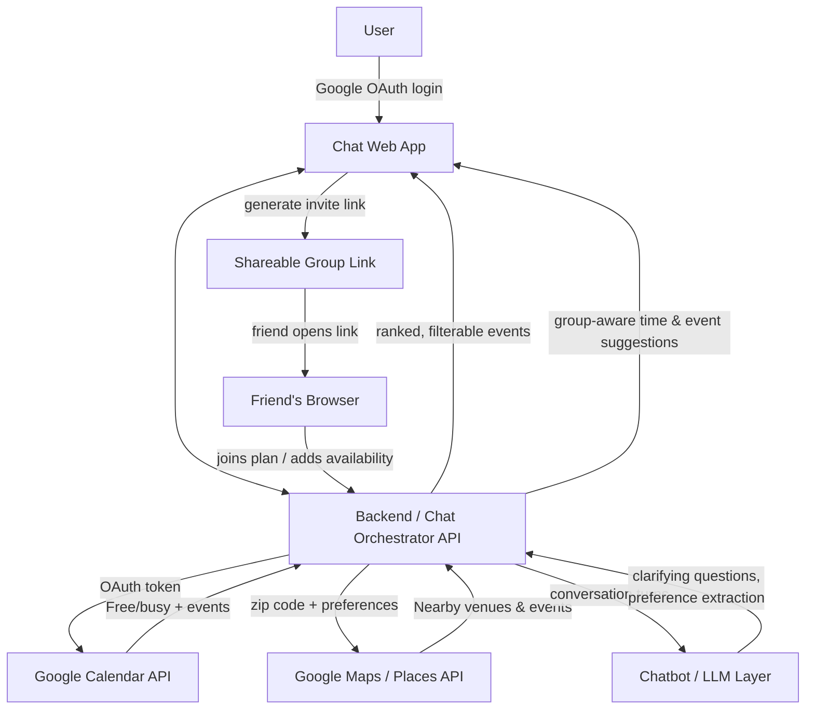

# HobbyGenie
HobbyGenie is a conversational assistant that looks at your calendar availability and your zipcode to recommend local hobbies and events.

---

### What we built
HobbyGenie is a chat web app that checks your calendar and finds activities near you. HobbyGenie does all three in one conversation:

1. Sign in with Google account
2. You land directly in a chat interface.
3. You share your Google Calendar (or just tell the bot when you're free).
4. You give a zip code and optionally, a few preferences.
5. The assistant cross-references your open time slots with nearby events and hobbies and returns a filterable list.
6. If you want company, you generate a shareable invite link so friends can join the plan and it becomes a group activity.

### How it functions
- **Auth**: Google OAuth login gives us identity plus (with consent) calendar read access.
- **Conversational interface**: A chat UI is the front door for the whole experience. The assistant asks clarifying questions ("Any other preferences?") and falls back to sensible defaults (popular local activities) if the user doesn't answer.
- **Availability**: If the user grants calendar access, we pull free/busy blocks from the Google Calendar API and render them on-page. If that integration isn't ready in time, the assistant simply asks the user for their availability in natural language and reasons over the answer — same downstream result, lower-effort input path.
- **Discovery**: Zip code + preferences are sent to the Google Maps/Places API to source nearby venues and events, which get merged with the user's free time windows into a ranked, filterable list (distance, category, time of day).
- Next Steps: **Group activities**: A user can generate an invite link for a specific plan. Friends who open it can add the event to their own calendar and (in a stretch version) contribute their own availability, so the app can suggest a time that works for the whole group rather than just the organizer.

---

## Architecture



**Request flow, in short:** the frontend never talks to Google APIs directly — every external call is proxied through the backend so OAuth tokens stay server-side. The chatbot layer is stateless per turn; conversation state (calendar data, zip code, preferences collected so far) is passed back in on each call so any step can be re-entered without losing context.

---

## Tech Stack

| Layer | Technology | Purpose |
|---|---|---|
| Frontend | React (chat UI) | Single conversational interface, renders calendar + results inline |
| Auth | Google OAuth 2.0 | Gmail login, calendar consent scope |
| Backend | Node.js / Express (or Python / FastAPI) | Orchestrates calendar, maps, and chatbot calls; holds tokens |
| Calendar data | Google Calendar API | Free/busy lookup, event creation for group plans |
| Location/events | Google Maps / Places API | Nearby venues, categories, geocoding from zip code |
| Conversational AI | LLM (e.g. Claude/GPT via API) | Preference elicitation, natural-language availability parsing, ranking rationale |
| Sharing | Signed short-lived invite links | Friend join flow for group activities |
| Hosting | Vercel / Render / Firebase (pick one) | Deployment for demo |

---

## Setup & Run Instructions

### Prerequisites
- Node.js 18+ and npm (or Python 3.10+ if using a Python backend)
- A Google Cloud project with the **Calendar API** and **Places/Maps API** enabled
- OAuth 2.0 credentials (Client ID/Secret) with the `calendar.readonly` scope authorized
- An API key for your chosen LLM provider

### 1. Clone and install
```bash
git clone <your-repo-url>
cd hobbysync
npm install        # installs both frontend and backend deps if using a monorepo
```

### 2. Configure environment variables
Copy `server/.env.example` to `server/.env` and fill it in:
```
# Chat (required) — free key from https://aistudio.google.com/apikey
GEMINI_API_KEY=your_key_here
GEMINI_MODEL=gemini-2.5-flash
PORT=4000

# Google Calendar read access (OAuth 2.0)
GOOGLE_CLIENT_ID=your_client_id
GOOGLE_CLIENT_SECRET=your_client_secret
CLIENT_URL=http://localhost:3000
OAUTH_REDIRECT_URI=http://localhost:3000/api/auth/google/callback

# Later, for Maps / group plans
GOOGLE_MAPS_API_KEY=your_maps_key
```

The chat backend calls Gemini with Google Search grounding, so recommendations use
real, current venue/event info. The React client proxies `/api/*` to the server via
`client/src/setupProxy.js` (this replaces the old `"proxy"` string so full-page OAuth
redirects are forwarded too).

**Google Cloud setup for Calendar:**
1. In the Google Cloud project, enable the **Google Calendar API**.
2. Create an **OAuth 2.0 Client ID** of type *Web application*.
3. Add `http://localhost:3000/api/auth/google/callback` as an **Authorized redirect URI**.
4. On the OAuth consent screen, add the scope
   `https://www.googleapis.com/auth/calendar.readonly` and add your Google account as
   a test user (while the app is unverified).
5. Put the client ID/secret in `server/.env` as above.

The server holds tokens in memory (per session cookie), pulls free/busy from the
Calendar API, derives open windows in 8am–10pm, shows them under the header, and
passes them to the chat model so suggestions fit your schedule.

### 3. Run the backend
```bash
cd server
npm run dev        # starts API on http://localhost:4000
```

### 4. Run the frontend
```bash
cd client
npm start           # starts chat UI on http://localhost:3000
```

### 5. Try it out
1. Open `http://localhost:3000`.
2. Sign in with Google.
3. Click "Share Calendar" (or just tell the chatbot when you're free).
4. Enter a zip code when asked.
5. Answer (or skip) the preference question.
6. Browse and filter the suggested activities, and generate an invite link to turn one into a group plan.

---

## Key Design Decisions

- **Chat-first, not dashboard-first**: A conversational interface lets the app ask only for the information it actually needs, in the order it needs it, instead of front-loading a form. This also makes the "no calendar access yet" fallback (asking for availability directly) a natural extension of the same interface rather than a separate mode.
- **Graceful degradation on calendar sharing**: Calendar-button integration (rendering the calendar on-page) is treated as an enhancement, not a dependency — the core flow (chatbot asks/infers availability) works with or without it, so the feature can be descoped under time pressure without breaking the demo.
- **Backend-mediated API calls**: All Google Calendar/Maps calls are proxied through the backend so OAuth tokens and API keys never reach the client.
